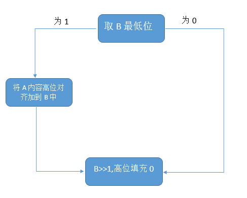

# P6_CPU_Document

## 流水线架构

| 阶段                  | 简称 | 功能概述                                               |
| --------------------- | ---- | ------------------------------------------------------ |
| 取指阶段（Fetch）     | F    | 从指令存储器中读取指令                                 |
| 译码阶段（Decode）    | D    | 从寄存器文件中读取源操作数并对指令译码以便得到控制信号 |
| 执行阶段（Execute）   | E    | 使用 ALU 执行计算                                      |
| 存储阶段（Memory）    | M    | 读或写数据存储器                                       |
| 写回阶段（Writeback） | W    | 将结果写回到寄存器文件                                 |

* 流水线寄存器以其供给数据的流水级的简称命名

### 顶层模块

#### mips.v

接口定义如下：

```verilog
module mips(
    input clk,
    input reset,
    input [31:0] i_inst_rdata,
    input [31:0] m_data_rdata,
    output [31:0] i_inst_addr,
    output [31:0] m_data_addr,
    output [31:0] m_data_wdata,
    output [3 :0] m_data_byteen,
    output [31:0] m_inst_addr,
    output w_grf_we,
    output [4:0] w_grf_addr,
    output [31:0] w_grf_wdata,
    output [31:0] w_inst_addr
);
```

|       信号名        | 方向 |                    描述                    |
| :-----------------: | :--: | :----------------------------------------: |
|         clk         |  I   |                  时钟信号                  |
|        reset        |  I   |                同步复位信号                |
| i_inst_rdata [31:0] |  I   |        i_inst_addr 对应的 32 位指令        |
| m_data_rdata [31:0] |  I   |        m_data_addr 对应的 32 位数据        |
| i_inst_addr [31:0]  |  O   | 需要进行取指操作的流水级 PC（一般为 F 级） |
| m_data_addr [31:0]  |  O   |            数据存储器待写入地址            |
| m_data_wdata [31:0] |  O   |            数据存储器待写入数据            |
| m_data_byteen [3:0] |  O   |                字节使能信号                |
| m_inst_addr [31:0]  |  O   |                  M 级 PC                   |
|      w_grf_we       |  O   |               GRF 写使能信号               |
|  w_grf_addr [4:0]   |  O   |           GRF 中待写入寄存器编号           |
| w_grf_wdata [31:0]  |  O   |              GRF 中待写入数据              |
| w_inst_addr [31:0]  |  O   |                  W 级 PC                   |

### 存储器外置

```verilog
`timescale 1ns/1ps

module mips_txt;

    reg clk;
    reg reset;

    wire [31:0] i_inst_addr;
    wire [31:0] i_inst_rdata;

    wire [31:0] m_data_addr;
    wire [31:0] m_data_rdata;
    wire [31:0] m_data_wdata;
    wire [3 :0] m_data_byteen;

    wire [31:0] m_inst_addr;

    wire w_grf_we;
    wire [4:0] w_grf_addr;
    wire [31:0] w_grf_wdata;

    wire [31:0] w_inst_addr;

    mips uut(
        .clk(clk),
        .reset(reset),

        .i_inst_addr(i_inst_addr),
        .i_inst_rdata(i_inst_rdata),

        .m_data_addr(m_data_addr),
        .m_data_rdata(m_data_rdata),
        .m_data_wdata(m_data_wdata),
        .m_data_byteen(m_data_byteen),

        .m_inst_addr(m_inst_addr),

        .w_grf_we(w_grf_we),
        .w_grf_addr(w_grf_addr),
        .w_grf_wdata(w_grf_wdata),

        .w_inst_addr(w_inst_addr)
    );

    integer i;
    reg [31:0] fixed_addr;
    reg [31:0] fixed_wdata;
    reg [31:0] data[0:4095];
    reg [31:0] inst[0:4095];

    assign m_data_rdata = data[m_data_addr >> 2];
    assign i_inst_rdata = inst[(i_inst_addr - 32'h3000) >> 2];

    initial begin
        $readmemh("code.txt", inst);
        for (i = 0; i < 4096; i = i + 1) data[i] <= 0;
    end

    initial begin
        clk = 0;
        reset = 1;
        #20 reset = 0;
    end

    always @(*) begin
        fixed_wdata = data[m_data_addr >> 2];
        fixed_addr = m_data_addr & 32'hfffffffc;
        if (m_data_byteen[3]) fixed_wdata[31:24] = m_data_wdata[31:24];
        if (m_data_byteen[2]) fixed_wdata[23:16] = m_data_wdata[23:16];
        if (m_data_byteen[1]) fixed_wdata[15: 8] = m_data_wdata[15: 8];
        if (m_data_byteen[0]) fixed_wdata[7 : 0] = m_data_wdata[7 : 0];
    end

    always @(posedge clk) begin
        if (reset) for (i = 0; i < 4096; i = i + 1) data[i] <= 0;
        else if (|m_data_byteen) begin
            data[fixed_addr >> 2] <= fixed_wdata;
            $display("%d@%h: *%h <= %h", $time, m_inst_addr, fixed_addr, fixed_wdata);
				//$display("@%h: *%h <= %h", m_inst_addr, fixed_addr, fixed_wdata);
        end
    end

    always @(posedge clk) begin
        if (~reset) begin
            if (w_grf_we && (w_grf_addr != 0)) begin
                $display("%d@%h: $%d <= %h", $time, w_inst_addr, w_grf_addr, w_grf_wdata);
					 //$display("@%h: $%d <= %h", w_inst_addr, w_grf_addr, w_grf_wdata);
            end
        end
    end

    always #2 clk <= ~clk;

endmodule
```


### 取指阶段（Fetch）

#### PC

这里的 $PC$ 采用下面这种方式直接**在顶层模块 $mips$ 中**实现：

```verilog
    reg [31:0] PC;

    initial begin
        PC = 32'h00003000;
    end

    always @(posedge clk) begin
        if (reset) begin
            PC <= 32'h00003000;
        end
        else begin
            PC <= NPC_NPC;
        end
    end
```

#### npc.v

* 端口定义

|   名称    |       描述       | 位宽 | 方向 |
| :-------: | :--------------: | :--: | :--: |
|   Stall   |     暂停信号     |  1   |  I   |
| HILO_BUSY | 乘除指令阻塞信号 |  1   |  I   |
|  isHILO   | 乘除指令判断信号 |  1   |  I   |
|    PC     |   当前指令地址   |  32  |  I   |
|   imm26   |    26位立即数    |  26  |  I   |
|    EXT    |   位扩展器结果   |  32  |  I   |
|    RD1    |  寄存器读数据1   |  32  |  I   |
|  nPC_sel  |   跳转控制信号   |  2   |  I   |
|  isSame   |   相等比较信号   |  1   |  I   |
|    NPC    |  下一条指令地址  |  32  |  O   |
|   flush   |  清空延迟槽信号  |  1   |  O   |

* 若暂停信号 $Stall$ 有效或信号 $HILO\_BUSY$ 和 $isHILO$ **同时**有效，则 $NPC$ 保持不变
* 若对应指令满足清空延迟槽条件，则输出清空延迟槽信号 $flush$ 为 $1$ 

#### d_reg.v

* 端口定义

|   名称    |       描述       | 位宽 | 方向 |
| :-------: | :--------------: | :--: | :--: |
|    clk    |     时钟信号     |  1   |  I   |
|   reset   |   同步复位信号   |  1   |  I   |
|   Stall   |     暂停信号     |  1   |  I   |
| HILO_BUSY | 乘除指令阻塞信号 |  1   |  I   |
|  isHILO   | 乘除指令判断信号 |  1   |  I   |
|   flush   |    清空延迟槽    |  1   |  I   |
| instr_in  |     F级指令      |  32  |  I   |
|   PC_in   |      F级PC       |  32  |  I   |
| instr_out |     D级指令      |  32  |  O   |
|  PC_out   |      D级PC       |  32  |  O   |

* 若暂停信号 $Stall$ 有效或信号 $HILO\_BUSY$ 和 $isHILO$ **同时**有效，则 $instr\_out$ 与 $PC\_out$ 保持不变
* 若清空延迟槽信号 $flush$ 有效**且暂停信号 $Stall$ 无效**，则清空 $D$ 级寄存器

### 译码阶段（Decord）

#### Stall

当一个指令到达 $D$ 级后，我们需要将它的 $T_{use}$ 值与后面每一级的 $T_{new}$ 进行比较，并进行 $A$ 值的校验。

* 当 $T_{use} ≥ T_{new}$ 时，我们可以通过**转发**来解决冒险 

* 当 $T_{use} < T_{new}$ 时，我们就需要**阻塞**流水线

```verilog
    assign Stall_RS = (((T_use_rs < T_new_E) & (rs == A3_E) & RegWrite_E) |
                       ((T_use_rs < T_new_M) & (rs == A3_M) & RegWrite_M)) &
        				(rs != 5'd0);
    assign Stall_RT = (((T_use_rt < T_new_E) & (rt == A3_E) & RegWrite_E) |
                       ((T_use_rt < T_new_M) & (rt == A3_M) & RegWrite_M)) &
        				(rt != 5'd0);
    assign Stall = Stall_RS | Stall_RT;
```

#### ctrl.v

* 端口定义

|   名称   |           描述           | 位宽 | 方向 |
| :------: | :----------------------: | :--: | :--: |
|    op    |        指令操作码        |  6   |  I   |
|  funct   |        指令功能码        |  6   |  I   |
|  RegDst  |    GRF写地址选择信号     |  2   |  O   |
|  ExtOp   |       位扩展控制码       |  2   |  O   |
|  ALUSrc  |    ALU操作数B选择信号    |  1   |  O   |
|  ALUOP   |        ALU控制码         |  4   |  O   |
|  isHILO  |       乘除指令信号       |  1   |  O   |
| HILOtype |     乘除指令信号类型     |  4   |  O   |
| RegWrite |       寄存器写使能       |  1   |  O   |
| MemWrite |     数据存储器写使能     |  1   |  O   |
| MemtoReg |   寄存器写数据选择信号   |  2   |  O   |
| storeOP  | 数据存储器写数据控制信号 |  2   |  O   |
|  DextOP  |  数据存储器数据扩展信号  |  3   |  O   |
| nPC_sel  |       跳转控制信号       |  3   |  O   |
| T_use_rs |    GPR[rs]的需求时间     |  2   |  O   |
| T_use_rt |    GPR[rt]的需求时间     |  2   |  O   |

这里采用了**控制信号驱动型**的**集中式译码**

* 控制信号

|              | add(addu) | sub(subu) | and(or) | slt(sltu) | addi(addiu) | andi(ori) | lui  | mult/div |  mt  |  mf  | load | store | beq  | bne  | jal  |  jr  |  j   |
| :----------: | :-------: | :-------: | :-----: | :-------: | :---------: | :-------: | :--: | :------: | :--: | :--: | :--: | :---: | :--: | :--: | :--: | :--: | :--: |
|  **RegDst**  |    rd     |    rd     |   rd    |    rd     |     rt      |    rt     |  rt  |    X     |  X   |  rd  |  rt  |   X   |  X   |  X   |  ra  |  X   |  X   |
|  **ExtOp**   |     X     |     X     |    X    |     X     |    SIGN     |   ZERO    | HIGN |    X     |  X   |  X   | SIGN | SIGN  | SIGN | SIGN |  X   |  X   |  X   |
|  **ALUSrc**  |     0     |     0     |    0    |     0     |      1      |     1     |  1   |    0     |  X   |  X   |  1   |   1   |  0   |  0   |  X   |  X   |  X   |
|  **ALUOP**   |    ADD    |    SUB    | AND(OR) | SLT(SLTU) |     ADD     |  AND(OR)  | ADD  |    X     |  X   |  X   | ADD  |  ADD  |  X   |  X   |  X   |  X   |  X   |
| **RegWrite** |     1     |     1     |    1    |     1     |      1      |     1     |  1   |    0     |  0   |  1   |  1   |   0   |  0   |  0   |  1   |  0   |  0   |
| **MemtoReg** |    ALU    |    ALU    |   ALU   |    ALU    |     ALU     |    ALU    | ALU  |    X     |  X   | HILO |  DM  |   X   |  X   |  X   |  PC  |  X   |  X   |
| **nPC_sel**  |    PC4    |    PC4    |   PC4   |    PC4    |     PC4     |    PC4    | PC4  |   PC4    | PC4  | PC4  | PC4  |  PC4  | BEQ  | BNE  |  J   |  JR  |  J   |
| **T_use_rs** |     1     |     1     |    1    |     1     |      1      |     1     |  3   |    1     |  1   |  3   |  1   |   1   |  0   |  0   |  3   |  0   |  3   |
| **T_use_rt** |     1     |     1     |    1    |     1     |      3      |     3     |  3   |    1     |  3   |  3   |  3   |   2   |  0   |  0   |  3   |  3   |  3   |

1. 信号 $isHILO$ 与 $HILOtype$ 只对指令 $mult, multu, div, divu, mthi, mtlo, mfhi, mflo$ 生效，未列于表中
2. 信号 $storeOP$ 只对指令 $sw(2'd1), sh(2'd2), sb(2'd3)$ 生效，未列于表中
3. 信号 $DextOP$ 只对指令 $lw(dext\_lw), lh(dext\_lh), lhu(dext\_lhu), lb(dext\_lb), lbu(dext\_lbu)$ 生效，未列于表中
4. 指令的需求时间 $T_{use}$ 是指这条指令位于 $D$ 级的时候，**再经过多少个时钟周期就必须要使用相应的数据**
5. 实际上， $T_{use}$ 的最大值为 $2'd2$ ，当指令用不到 $GPR[rs]$ 或 $GPR[rt]$ 时，我们将对应的置 $T_{use}$ 为 $2'd3$ ，这并不会影响我们对转发和暂停的判断

#### grf.v

* 端口定义

|   名称   |          描述          | 位宽 | 方向 |
| :------: | :--------------------: | :--: | :--: |
|   clk    |        时钟信号        |  1   |  I   |
|  reset   |      同步复位信号      |  1   |  I   |
| RegWrite |      寄存器写使能      |  1   |  I   |
|    PC    |     当前指令的地址     |  32  |  I   |
|    A1    |        读地址1         |  5   |  I   |
|    A2    |        读地址2         |  5   |  I   |
|    A3    |        读地址3         |  5   |  I   |
|    WD    |         写数据         |  32  |  I   |
|   RD1    | 输出A1指定的寄存器数据 |  32  |  O   |
|   RD2    | 输出A2指定的寄存器数据 |  32  |  O   |

#### ext.v

* 端口定义

|    名称    |     描述     | 位宽 | 方向 |
| :--------: | :----------: | :--: | :--: |
|   imm16    |  16位立即数  |  16  |  I   |
|   ExtOP    | 位扩展控制码 |  2   |  I   |
| EXT_Result |  位扩展结果  |  32  |  O   |

#### cmp.v

* 端口定义

|  名称   |     描述     | 位宽 | 方向 |
| :-----: | :----------: | :--: | :--: |
| GRF_RD1 |  GRF读数据1  |  32  |  I   |
| GRF_RD2 |  GRF读数据2  |  32  |  I   |
| isSame  | 相等比较信号 |  1   |  O   |

* 这里添加一个 $CMP$ 模块是为了将**$B$ 类跳转指令的**判定**提前至 $D$ 级**来进行，不再使用 $E$ 级的 $ALU$ 来进行判定

#### e_reg.v

* 端口定义

|      名称      |       描述       | 位宽 | 方向 |
| :------------: | :--------------: | :--: | :--: |
|      clk       |     时钟信号     |  1   |  I   |
|     reset      |   同步复位信号   |  1   |  I   |
|     Stall      |     暂停信号     |  1   |  I   |
|   HILO_BUSY    | 乘除指令阻塞信号 |  1   |  I   |
|     isHILO     | 乘除指令判断信号 |  1   |  I   |
|     PC_in      |      D级PC       |  32  |  I   |
|       op       |  D级指令操作码   |  6   |  I   |
|     funct      |  D级指令功能码   |  6   |  I   |
|    shamt_in    |     D级shamt     |  5   |  I   |
|   ALUSrc_in    |    D级ALUSrc     |  1   |  I   |
|    ALUOP_in    |     D级ALUOP     |  4   |  I   |
|  RegWrite_in   |   D级RegWrite    |  1   |  I   |
|  MemtoReg_in   |   D级MemtoReg    |  2   |  I   |
|   storeOP_in   |    D级storeOP    |  2   |  I   |
|   DextOP_in    |    D级DextOP     |  3   |  I   |
|     A1_in      | D级寄存器读地址1 |  5   |  I   |
|     A2_in      | D级寄存器读地址2 |  5   |  I   |
|   GRF_RD1_in   | D级寄存器读数据1 |  32  |  I   |
|   GRF_RD2_in   | D级寄存器读数据2 |  32  |  I   |
|     A3_in      | D级寄存器写地址  |  5   |  I   |
| EXT_Result_in  |  D级位扩展结果   |  32  |  I   |
|     PC_out     |      E级PC       |  32  |  O   |
|   shamt_out    |     E级shamt     |  5   |  O   |
|     T_new      | E级指令供给时间  |  2   |  O   |
|   ALUSrc_out   |    E级ALUSrc     |  1   |  O   |
|   ALUOP_out    |     E级ALUOP     |  4   |  O   |
|  RegWrite_out  |   E级RegWrite    |  1   |  O   |
|  MemtoReg_out  |   E级MemtoReg    |  2   |  O   |
|    storeOP     |    E级storeOP    |  2   |  O   |
|     DextOP     |    E级DextOP     |  3   |  O   |
|     A1_out     | E级寄存器读地址1 |  5   |  O   |
|     A2_out     | E级寄存器读地址2 |  5   |  O   |
|  GRF_RD1_out   | E级寄存器读数据1 |  32  |  O   |
|  GRF_RD2_out   | E级寄存器读数据2 |  32  |  O   |
|     A3_out     | E级寄存器写地址  |  5   |  O   |
| EXT_Result_out |  E级位扩展结果   |  32  |  O   |

* 指令的供给时间 $T_{new}$ 是指位于**某个流水级**的**某个指令**，它经过多少个时钟周期可以算出结果并且**存储到流水级寄存器里**
* 若暂停信号 $Stall$ 有效或信号 HILO\_BUSY 和 isHILO **同时**有效，则清空 $E\_REG$ (效果同 $reset$ )

### 执行阶段（Excute）

#### alu.v

* 端口定义

| 名称  |   描述    | 位宽 | 方向 |
| :---: | :-------: | :--: | :--: |
|   A   |  操作数A  |  32  |  I   |
|   B   |  操作数B  |  32  |  I   |
| shamt |  移位数   |  5   |  I   |
| ALUOp | ALU控制码 |  4   |  I   |
|   C   | 运算结果  |  32  |  O   |

#### md.v

* 端口定义

|   名称    |       描述       | 位宽 | 方向 |
| :-------: | :--------------: | :--: | :--: |
|    clk    |     时钟信号     |  1   |  I   |
|   reset   |   同步复位信号   |  1   |  I   |
| HILOtype  |   乘除指令类型   |  4   |  I   |
|     A     |     操作数A      |  32  |  I   |
|     B     |     操作数B      |  32  |  I   |
| HILO_BUSY | 乘除模块BUSY信号 |  1   |  O   |
|   HILO    |   乘除模块输出   |  32  |  O   |

1. 乘除指令（$mult,multu,div,divu$）会产生有效一个周期的 $start$ 信号
2. 乘法信号会在 $start$ 后产生有效5个周期的 $busy$ 信号，除法信号会在 $start$ 后产生有效10个周期的 $busy$ 信号
3. 在 $busy$ 的最后一个周期才会将计算结果写入 $HI/LO$ 寄存器

#### m_meg.v

* 端口定义

|     名称     |       描述       | 位宽 | 方向 |
| :----------: | :--------------: | :--: | :--: |
|     clk      |     时钟信号     |  1   |  I   |
|    reset     |   同步复位信号   |  1   |  I   |
|    PC_in     |      E级PC       |  32  |  I   |
|   T_new_in   | E级指令供给时间  |  2   |  I   |
| RegWrite_in  |   E级RegWrite    |  1   |  I   |
| MemtoReg_in  |   E级MemtoReg    |  2   |  I   |
|  storeOP_in  |    E级storeOP    |  2   |  I   |
|  DextOP_in   |    E级DextOP     |  3   |  I   |
|    A1_in     | E级寄存器读地址1 |  5   |  I   |
|    A2_in     | E级寄存器读地址2 |  5   |  I   |
|    A3_in     | E级寄存器写地址  |  5   |  I   |
|   ALU_C_in   |  E级ALU计算结果  |  32  |  I   |
|  GRF_RD2_in  | E级寄存器读数据2 |  32  |  I   |
|    PC_out    |      M级PC       |  32  |  O   |
|  T_new_out   | M级指令供给时间  |  2   |  O   |
| RegWrite_out |   M级RegWrite    |  1   |  O   |
| MemtoReg_out |   M级MemtoReg    |  2   |  O   |
| storeOP_out  |    M级storeOP    |  2   |  O   |
|  DextOP_out  |    M级DextOP     |  3   |  O   |
|    A1_out    | M级寄存器读地址1 |  5   |  O   |
|    A2_out    | M级寄存器读地址2 |  5   |  O   |
|    A3_out    | M级寄存器写地址  |  5   |  O   |
|  ALU_C_out   |  M级ALU计算结果  |  32  |  O   |
| GRF_RD2_out  | M级寄存器读数据2 |  32  |  O   |

### 存储阶段（Memory)

#### dext.v

* 端口定义

|  名称  |          描述           | 位宽 | 方向 |
| :----: | :---------------------: | :--: | :--: |
|   A    | 数据存储器读地址的低2位 |  2   |  I   |
|  D_in  |    数据存储器读地址     |  32  |  I   |
| dextOP |      数据扩展信号       |  3   |  I   |
| D_out  |      数据扩展结果       |  32  |  O   |

#### w_reg.v

* 端口定义

|     名称     |      描述       | 位宽 | 方向 |
| :----------: | :-------------: | :--: | :--: |
|     clk      |    时钟信号     |  1   |  I   |
|    reset     |  同步复位信号   |  1   |  I   |
|    PC_in     |      M级PC      |  32  |  I   |
|   T_new_in   | M级指令供给时间 |  2   |  I   |
| RegWrite_in  |   M级RegWrite   |  1   |  I   |
| MemtoReg_in  |   M级MemtoReg   |  2   |  I   |
|    A3_in     | M级寄存器写地址 |  5   |  I   |
|   ALU_C_in   | M级ALU计算结果  |  32  |  I   |
|   DM_RD_in   |   M级DM读数据   |  32  |  I   |
|    PC_out    |      W级PC      |  32  |  O   |
|  T_new_out   | W级指令供给时间 |  2   |  O   |
| RegWrite_out |   W级RegWrite   |  1   |  O   |
| MemtoReg_out |   W级MemtoReg   |  2   |  O   |
|    A3_out    | W级寄存器写地址 |  5   |  O   |
|  ALU_C_out   | W级ALU计算结果  |  32  |  O   |
|  DM_RD_out   |   W级DM读数据   |  32  |  O   |


## 思考题

1. 为什么需要有单独的乘除法部件而不是整合进 ALU？为何需要有独立的 HI、LO 寄存器？

   答：乘除法需要若干个周期来完成，且需要将计算结果存入 HI、 LO 寄存器中。 HI 、 LO 的值只有在遇到 $mfhi,mflo$ 指令时才取出，且遇到 $mthi,mtlo$ 指令时要将数据存入 HI、LO 寄存器中。

2. 真实的流水线 CPU 是如何使用实现乘除法的？请查阅相关资料进行简单说明。

   答：

   * 乘法

     32位被乘数寄存器(简称A)初始化为乘法运算的被乘数，64位积寄存器 (简称B)高32位置零，用来存放乘积，低32位初始化为乘数。进行32次迭代，对于每次迭代：

     

     有符号乘法只需另外计算符号位即可

   * 除法

     32位商寄存器全部置零，32位除数寄存器填充32位除数，65位余数寄存器左半部分置零，右半部分填充32位被除数。处理结构图：

     

     有符号除法只需另外计算符号位即可

3. 请结合自己的实现分析，你是如何处理 Busy 信号带来的周期阻塞的？

   答： $mult,multu,div,divu$ 指令会让乘除法模块产生有效一个时钟周期的 $start$ 信号和相应的有效 5 或 10 个周期的 $busy$ 信号，当 $HILO\_BUSY = start | busy$ 有效时，会让乘除法指令在 $NPC$ 、 $D\_REG$ 模块阻塞一个周期，并清空 $E\_REG$ 。

4. 请问采用字节使能信号的方式处理写指令有什么好处？（提示：从清晰性、统一性等角度考虑）

   答：从清晰性来说，采用字节使能信号能够清晰地显示当前指令要写哪些字节；从统一性来说，字节使能信号将写使能信号和字节控制信号统一起来，使得写宽度不同的指令可以共用该信号。

5. 请思考，我们在按字节读和按字节写时，实际从 DM 获得的数据和向 DM 写入的数据是否是一字节？在什么情况下我们按字节读和按字节写的效率会高于按字读和按字写呢？

   答：在按字节读和按字节写时，实际从 DM 获得的数据和向 DM 写入的数据并不是一字节，而是一字。当 DM 的单位容量不为 $32bits$ ，而是 $8bits$ 时，按字节读写的效率高于按字读写。

6. 为了对抗复杂性你采取了哪些抽象和规范手段？这些手段在译码和处理数据冲突的时候有什么样的特点与帮助？

   答：将各种控制信号的不同取值用宏来表示，而且这些宏的命名带有其对应的控制信号名。这样能够直观地识别、读写各个控制信号的取值以及含义。

7. 在本实验中你遇到了哪些不同指令类型组合产生的冲突？你又是如何解决的？相应的测试样例是什么样的？

   答：和P5一样，不同指令的 $T_{use}$ 与 $ T_{new}$ 不同，产生不同的冲突。利用条件转发来解决。

8. 如果你是手动构造的样例，请说明构造策略，说明你的测试程序如何保证**覆盖**了所有需要测试的情况；如果你是**完全随机**生成的测试样例，请思考完全随机的测试程序有何不足之处；如果你在生成测试样例时采用了**特殊的策略**，比如构造连续数据冒险序列，请你描述一下你使用的策略如何**结合了随机性**达到强测的效果。

   答：手动构造样例，根据转发时发送数据和接收数据的流水级寄存器不同，来构造不同类型的测试样例。


 测试点 4787  WRONG ANSWER 

```
Your memory outputs are too few. We got nothing when we expected '@000033dc: * 00001e9c <= 000033e4'. *
```

 测试点 4786  WRONG ANSWER 

```
Wrong instruction behaviour. We got '@00003348: * 00000000 <= 00003060' when we expected '@000032d8: * 00000fa0 <= 000032e0'. *
```

 测试点 4785  WRONG ANSWER 

```
Wrong instruction behaviour. We got '@000032b8: * 00000000 <= 00000fa0' when we expected '@000032a8: * 00000fa0 <= 000032b0'. *
```

 测试点 4784  WRONG ANSWER 

```
Wrong instruction behaviour. We got '@00003698: * 00000078 <= aabbccdd' when we expected '@00003528: * 00000fa0 <= 00003530'. *
```

 测试点 4783  WRONG ANSWER 

```
Wrong instruction behaviour. We got '@0000410c: * 00000090 <= aabbccdd' when we expected '@00004018: * 00000fa0 <= 00004020'. *
```

 测试点 4782  WRONG ANSWER 

```
Wrong instruction behaviour. We got '@00004d90: * 00000060 <= aabbccdd' when we expected '@00004d70: * 00000fa0 <= 00004d78'. *
```

 测试点 4781  WRONG ANSWER 

```
Wrong instruction behaviour. We got '@00004a60: * 00000090 <= aabbccdd' when we expected '@000048f4: * 00000fa0 <= 000048fc'. *
```

 测试点 4780  WRONG ANSWER 

```
Wrong instruction behaviour. We got '@000034b0: * 00000094 <= aabbccdd' when we expected '@00003440: * 00000fa0 <= 00003448'. *
```

 测试点 4779  WRONG ANSWER 

```
Wrong instruction behaviour. We got '@00006a28: * 00000094 <= aabbccdd' when we expected '@000069c0: * 00000fa0 <= 000069c8'. *
```

 测试点 4778  WRONG ANSWER 

```
Wrong instruction behaviour. We got '@00004644: * 00000074 <= aabbccdd' when we expected '@000045d8: * 00000fa0 <= 000045e0'. *
```


L


 测试点 4818  WRONG ANSWER 

```
Wrong instruction behaviour. We got '@000030e4: $ 28 <= 0000c300' when we expected '@00003054: $ 10 <= 00000002'. *
```

 测试点 4817  WRONG ANSWER 

```
Wrong instruction behaviour. We got '@00006590: $ 15 <= 00000001' when we expected '@00006594: $ 5 <= 00000644'. *
```

 测试点 4816  WRONG ANSWER 

```
Wrong instruction behaviour. We got '@00004dec: $ 22 <= 0000003d' when we expected '@00004dec: $ 22 <= 000079fd'. *
```

 测试点 4815  WRONG ANSWER 

```
Unknown value: '@00005978: $ X <= xxxxxxxx'. 
```

 测试点 4814  WRONG ANSWER 

```
Wrong instruction behaviour. We got '@00003ca8: $ 4 <= ffff8cad' when we expected '@00003ca8: $ 4 <= ffffac41'. *
```

 测试点 4813  WRONG ANSWER 

```
Unknown value: '@000056b8: $ X <= xxxxxxxx'. 
```

 测试点 4812  WRONG ANSWER 

```
Wrong instruction behaviour. We got '@00004b3c: $ 4 <= 00000000' when we expected '@00004b3c: $ 4 <= 00000001'. *
```

 测试点 4811  WRONG ANSWER 

```
Unknown value: '@00003180: $ X <= xxxxxxxx'. 
```


| 格式 | jap target         |
| ---- | ------------------ |
| 描述 | 跳转并将PC推到栈顶 |

I : 

 vAddr ← GPR[29] 

 Memory[vAddr] ← PC + 8 

 GPR[29] ← GPR[29] - 4 

I + 1 : 

 PC ← PC31...28||target||02 


执行时间为 3 个时钟周期，其他行为与 DIV 指令相同            


lwmx rs, offset(base)                

内存值大于寄存器值时写入5号寄存器，否则写入4号寄存器                


Vaddr ← GPR[base] + sign_extend(offset)

Condition ← GPR[rt] < Memory[Vaddr] 

If condition:

GPR[5] ← Memory[Vaddr]

else:

GPR[4] ← Memory[Vaddr]

| 示例 | lwmx \$t5, (-100)\$t1                       |
| ---- | ------------------------------------------- |
| 其他 | 地址不是4的倍数时强制对齐。比大小是有符号数 |


