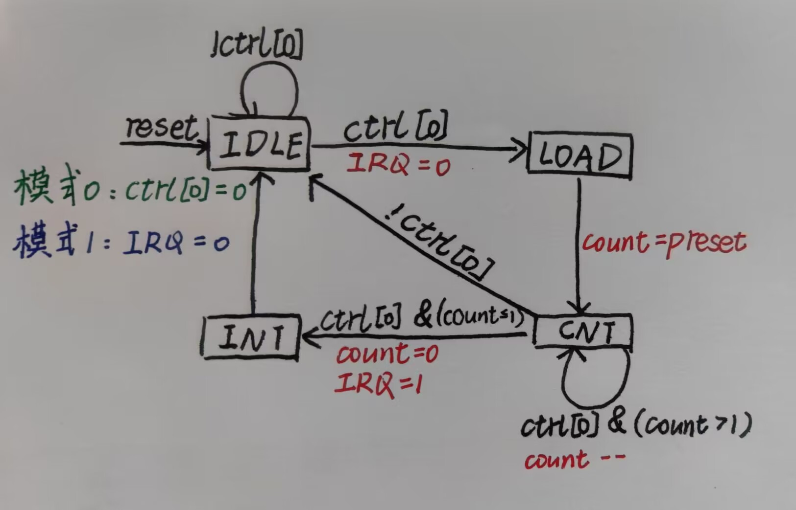

# P7_CPU_Document

## 任务清单

| 任务               | 解释                                                         |
| ------------------ | ------------------------------------------------------------ |
| 计时器             | 课程组提供实现代码，只需要结合代码和文档理解应用即可。       |
| 系统桥             | 为 CPU 提供统一的访问外设的接口，需要按规格自行实现。        |
| 协处理器 CP0       | 设置 CPU 的异常处理功能，反馈 CPU 的异常信息，需要按规格自行实现。 |
| 内部异常检测与流水 | CPU 需要具有可以检测内部指令执行错误的能力。                 |
| 外部中断响应       | CPU 需要具有初步响应外部中断信号的能力。                     |
| 异常处理指令       | 在异常处理程序中，会有一些特殊的指令需要实现。               |
| 单周期 CPU 的封装  | 让 CPU 从外部看上去是一个单周期 CPU。                        |
| 异常处理程序       | 利用 MARS 编写简单的异常处理程序用于测试。                   |


### 新增指令

和 P6 相比， P7 主要新增了 mfc0, mtc0, syscall, eret 四条指令，mfc0 和 mtc0 的处理相对比较简单，且应该不涉及冒险冲突问题。

#### syscall

这条指令在 P7 中直接视为一种异常来处理，开始时我因为忘记添加 `Exc_syscall 的判断而少了 interrupt count 。

#### eret

这条指令只会出现在异常处理程序的末尾，用来返回 EPC 。

首先要小心 EPC 的转发/阻塞问题。我在这里直接无脑阻塞了，并没有进行转发：

```verilog
assign Stall_eret = eret_D & 
    				((mtc0_E == 1'b1 && rd_E == 5'd14) ||
                     (mtc0_M == 1'b1 && rd_M == 5'd14));
```

eret 是一条跳转指令，但处于它的延迟槽中的指令是不会被执行的，我利用了 P5 中添加的清空延迟槽信号 flush 很简单地就解决了这一点。另外，由于延迟槽重的指令不会被执行，所以在 F 级判断取指异常时，不对 eret 延迟槽中的指令进行判断。

```verilog
wire ErrAdEL_F = (PC[1:0] != 2'b0 || PC < `PC_MIN || PC > `PC_MAX) & !eret_D;
```

eret 标志着异常处理程序的结束，所以直接将 eret_M 信号作为 EXLClr 输入给 CP0 以复位 EXL。

### 中断和异常

在 P7 中，我们要实现的中断和异常有以下几种：


需要注意的是异常与中断的优先级问题

1. 对于同一条指令来说，先产生的异常优先于后产生的异常（比如 D 级的异常优先于 M 级的异常）
2. 对于不同的指令来说，前面的指令产生的异常优先于后面的指令产生的异常（比如 M 级的异常优先于 D 级的异常）

因此，采用下面这样的方式来表示此优先级问题：

```verilog
assign ExcCode_D =  ExcCode_FD ? ExcCode_FD : 
    				ErrRI_D ? `Exc_RI :
    				syscall_D ? `Exc_Syscall :
    				`Exc_None;

assign ExcCode_E =  ExcCode_DE ? ExcCode_DE :
    				ErrOvAri_E ? `Exc_Ov :
    				`Exc_None;

assign ExcCode_M =  ExcCode_EM ? ExcCode_EM :
    				ErrAdEL_M ? `Exc_AdEL :
    				ErrAdES_M ? `Exc_AdES :
    				`Exc_None;   
```

### 乘除槽

当产生异常时，已经开始或产生结果的乘除指令不会停止，而尚未开始执行的乘除指令不应进行。

```verilog
// ......
else if (!Req || state != 4'd0) begin
    // ......
end
```

### CP0

CP0 模块的输入输出端口定义如下：

|    名称    |         描述          | 位宽 | 方向 |
| :--------: | :-------------------: | :--: | :--: |
|    clk     |       时钟信号        |  1   |  I   |
|   reset    |     同步复位信号      |  1   |  I   |
|   CP0_WE   |      写使能信号       |  1   |  I   |
|  CP0_addr  | 寄存器地址（12/13/14) |  5   |  I   |
|   CP0_in   |      CP0写入数据      |  32  |  I   |
|  CP0_out   |      CP0读出数据      |  32  |  O   |
|    VPC     |        受害PC         |  32  |  I   |
|    isBD    |   是否为延迟槽指令    |  1   |  I   |
| ExcCode_in |     记录异常类型      |  5   |  I   |
|   HWInt    |     输入中断信号      |  6   |  I   |
|   EXLClr   |      EXL复位信号      |  1   |  I   |
|  EPC_out   |        EPC输出        |  32  |  O   |
|    Req     |   进入处理程序请求    |  1   |  O   |

CP0 模块的作用就是，当遇到中断或者异常时，判断是否对该中断或异常进行处理，并进行相应的记录操作。

在 P7 中，我们只实现了 CP0 的 3 个寄存器（12-SR, 13-Cause, 14-EPC）的某些位，相应部分的功能如下：

| 寄存器               | 功能域                  | 位域  | 解释                                                         |
| -------------------- | ----------------------- | ----- | ------------------------------------------------------------ |
| SR（State Register） | IM（Interrupt Mask）    | 15:10 | 分别对应六个外部中断，相应位置 1 表示允许中断，置 0 表示禁止中断。这是一个被动的功能，只能通过 `mtc0` 这个指令修改，通过修改这个功能域，我们可以屏蔽一些中断。 |
| SR（State Register） | EXL（Exception Level）  | 1     | 任何异常发生时置位，这会强制进入核心态（也就是进入异常处理程序）并禁止中断。 |
| SR（State Register） | IE（Interrupt Enable）  | 0     | 全局中断使能，该位置 1 表示允许中断，置 0 表示禁止中断。     |
| Cause                | BD（Branch Delay）      | 31    | 当该位置 1 的时候，EPC 指向当前指令的前一条指令（一定为跳转），否则指向当前指令。 |
| Cause                | IP（Interrupt Pending） | 15:10 | 为 6 位待决的中断位，分别对应 6 个外部中断，相应位置 1 表示有中断，置 0 表示无中断，将会每个周期被修改一次，修改的内容来自计时器和外部中断。 |
| Cause                | ExcCode                 | 6:2   | 异常编码，记录当前发生的是什么异常。                         |
| EPC                  | -                       | -     | 记录异常处理结束后需要返回的 PC。                            |

首先， Req 由两部分组成，中断和异常都会把 Req 置 1 ，即

```verilog
wire Req_Int = (|(`IM & HWInt)) & `IE; // 中断未被屏蔽 且 检测到中断 且 允许中断
wire Req_Exc = (ExcCode_in != `Exc_None) ; // 检测到异常
assign Req = (Req_Int | Req_Exc) & !`EXL; // 检测到允许的中断或异常 且 不在处理程序中
```

在每个时钟周期，如果 Req 有效，应当将相应的信息记录在 CP0 相应的寄存器中。需要注意的是， EPC 是异常处理程序结束后（即 eret 指令）要跳转到的 PC 值。如果异常的指令位于前一条指令的延迟槽中，这里应当返回到前一条指令的 PC ，否则，应该跳转到受害 PC，即

```verilog
always @(posedge clk) begin
    // ......
    else if (Req) begin
        `EXL <= 1'b1;
        `ExcCode <= (Req_Int == 1'b1) ? `Exc_Int : ExcCode_in;
        `BD = isBD;
        EPC <= EPC_out;
    end
    // ......
end

assign EPC_out = (Req) ? (isBD ? VPC - 32'd4 : VPC) : EPC;
```

最后，不要忘了每个时钟周期要把 HWInt 的值更新到 IP 中

```verilog
// ......
`IP <= HWInt;
```

### 封装为单周期 CPU

在 P5, P6 中，我们设计的 CPU 是流水线 CPU ，而在 P7 要设计的 MIPS 微系统中， CPU 只是其中的一个组成部分。从 CPU 内部来看，它是流水线 CPU ，而从外部来看，我们不关心它的内部是如何实现的，而是要让看上去是一个单周期的 CPU 。据此，我们引入了“宏观 PC ”的概念，来表示该指令之前的所有指令序列对 CPU 的更新已完成，该指令及其之后的指令序列对 CPU 的更新未完成。在我的设计中，宏观 PC 即为 M 级 PC 。

封装后的 CPU 输入和输出端口如下：

|       信号名        | 方向 |          描述          |
| :-----------------: | :--: | :--------------------: |
|         clk         |  I   |        时钟信号        |
|        reset        |  I   |      同步复位信号      |
|     HWInt[5:0]      |  I   |                        |
| i_inst_addr [31:0]  |  O   |       IM 读地址        |
| i_inst_rdata [31:0] |  I   |       IM 读数据        |
| m_data_addr [31:0]  |  O   |      M 级读写地址      |
| m_data_rdata [31:0] |  I   |       M 级读数据       |
| m_data_wdata [31:0] |  O   |     M 级待写入数据     |
| m_data_byteen [3:0] |  O   |    M 级字节使能信号    |
| m_inst_addr [31:0]  |  O   |        M 级 PC         |
|        PC_M         |  O   |     GRF 写使能信号     |
|      w_grf_we       |  O   |     GRF 写使能信号     |
|  w_grf_addr [4:0]   |  O   | GRF 中待写入寄存器编号 |
| w_grf_wdata [31:0]  |  O   |    GRF 中待写入数据    |
| w_inst_addr [31:0]  |  O   |        W 级 PC         |
|         Req         |  O   |        异常信号        |

### Bridge

Bridge 模块的输入和输出端口如下：

|     名称      |          描述          | 位宽 | 方向 |
| :-----------: | :--------------------: | :--: | :--: |
|      Req      |        异常信号        |  1   |  I   |
|    DM_out     |        DM读数据        |  32  |  I   |
|    TC_out1    |       TC1读数据        |  32  |  I   |
|    TC_out2    |       TC2读数据        |  32  |  I   |
|     Addr      |        读写地址        |  32  |  I   |
| m_data_byteen |         写使能         |  4   |  I   |
|     D_out     |       Bridge输出       |  32  |  O   |
|    TC_WE1     |       TC1写使能        |  1   |  O   |
|    TC_WE2     |       TC2写使能        |  1   |  O   |
|  m_int_addr   |  中断发生器待写入地址  |  32  |  O   |
| m_int_byteen  | 中断发生器字节使能信号 |  4   |  O   |

CPU 与 外设（这里是 DM, TC1, TC2, InterruptGenerator）的沟通都是通过 Bridge 来实现的。

这里列出 P7 中规定的地址空间分配：

| 条目                 | 地址或地址范围          | 备注                   |
| -------------------- | ----------------------- | ---------------------- |
| 数据存储器           | 0x0000_0000∼0x0000_2FFF |                        |
| 指令存储器           | 0x0000_3000∼0x0000_6FFF |                        |
| PC 初始值            | 0x0000_3000             |                        |
| 异常处理程序入口地址 | 0x0000_4180             |                        |
| 计时器 0 寄存器地址  | 0x0000_7F00∼0x0000_7F0B | 计时器 0 的 3 个寄存器 |
| 计时器 1 寄存器地址  | 0x0000_7F10∼0x0000_7F1B | 计时器 1 的 3 个寄存器 |
| 中断发生器响应地址   | 0x0000_7F20∼0x0000_7F23 |                        |

对于读数据来说，我们把各个外设的读数据都输入到 Bridge 中，根据 CPU 传来的地址不同，反馈给 CPU 不同的读数据。

```verilog
    assign D_out =  (Addr >= `DM_begin && Addr <= `DM_end) ? DM_out :
                    (Addr >= `TC1_begin && Addr <= `TC1_end) ? TC_out1 :
                    (Addr >= `TC2_begin && Addr <= `TC2_end) ? TC_out2 :
                    32'b0;
```

对于写数据来说，实际上 CPU 将要写的数据传入 Bridge ，我在实现的时候直接将 m_data_wdata 传入各个外设了。然后 Bridge 通过 CPU 传入读写地址以及写使能信号来生成各个外设的写使能信号，从而实现控制写外设的功能。

```verilog
assign TC_WE1 = (|m_data_byteen) &
    			!Req &
    			(Addr >= `TC1_begin && Addr <= `TC1_end); // TC1 写使能
assign TC_WE2 = (|m_data_byteen) &
    			!Req &
    			(Addr >= `TC2_begin && Addr <= `TC2_end); // TC2 写使能

assign m_data_byteen = Req ? 4'b0000 : DM_WE; // DM 写使能
```

另外， P7 要求在 mips 的输出端口中输出 m_int_addr （中断发生器待写入地址）和 m_int_byteen （中断发生器字节使能信号）：

```verilog
assign m_int_addr = Addr;
assign m_int_byteen = (Addr >= `Int_begin && Addr <= `Int_end) ? m_data_byteen : 
    					4'b0000;
```

## 思考题

1、请查阅相关资料，说明鼠标和键盘的输入信号是如何被 CPU 知晓的？

答：鼠标和键盘产生中断信号 interrupt ，中断信号从中断发生器经由 Bridge 传给 CPU 。

2、请思考为什么我们的 CPU 处理中断异常必须是已经指定好的地址？如果你的 CPU  支持用户自定义入口地址，即处理中断异常的程序由用户提供，其还能提供我们所希望的功能吗？如果可以，请说明这样可能会出现什么问题？否则举例说明。（假设用户提供的中断处理程序合法）

答：P7 规定了异常处理程序的入口地址为 0x0000_4180 ，正常情况下应该只能通过异常和中断来访问异常处理程序，如果自定义入口地址的话， CPU 无法对其加以限制，可能出现无异常或中断仍进入处理程序的情况。

3、为何与外设通信需要 Bridge？

答：如果把 CPU 和每一个外设都直接相连，不仅会复杂化 CPU 的端口，而且在添加或删除外设时又要重新修改 CPU 的端口。通过 Bridge ，我们可以将所有外设同等看待，而且 CPU 只需给出要访存的外设地址和相应数据， Bridge 就可以帮助 CPU 进行相应的访存操作。

4、请阅读官方提供的定时器源代码，阐述两种中断模式的异同，并分别针对每一种模式绘制状态移图。

答：两种中断模式的不同点就在于计数结束后，模式 0 自动将使能信号置为 0 ，而模式 1 不改变使能信号，而是将中断信号置为 0 。



5、倘若中断信号流入的时候，在检测宏观 PC 的一级如果是一条空泡（你的 CPU 该级所有信息均为空）指令，此时会发生什么问题？在此例基础上请思考：在 P7 中，清空流水线产生的空泡指令应该保留原指令的哪些信息？

答：空泡流水的宏观 PC 为 0 ，其所有信号都为 0 。如果此时产生中断信号，输入 CP0 的 VPC  和 isBD 值为 0 ， EPC 中就会存入错误的值。所以为了保证 CP0 正常工作不出现错误，在清空流水线产生的空泡指令应当保留原指令的 PC 和 isBD 信号。

6、为什么 `jalr` 指令为什么不能写成 `jalr $31, $31`？

答：当两个寄存器相同时，如果延迟槽中的指令出现了异常，则会重新执行 jalr 指令，但之前执行的 jalr 指令并不会撤销，也就是要载入 PC 的寄存器已经被改写了，这样就会出现错误。

为啥无异常的时候 Mars 也无法正常跳转？

看了英文指令集，发现是因为这条指令是先写入寄存器，再执行延迟槽，然后再跳转到相应的 PC 。

## 导出中断处理程序

导出中断处理程序，命令如下：

```
java -jar E:\Mars4_5.jar a db mc CompactDataAtZero dump 0x00004180-0x00004ffc HexText E:\code_handler.txt E:\source.txt
java -jar ‪D:\study\CO\P7\Mars_p7\Mars.jar a db mc CompactDataAtZero dump 0x00004180-0x00004ffc HexText ‪D:\study\CO\P7\P7_MIPS\handler.txt D:\study\CO\P7\Mars_p7\mips1.asm
```

解析：

* `E:\Mars4_5.jar` 是 MARS 的文件路径

* `a db mc CompactDataAtZero dump` 参数

* `0x00004180-0x00004ffc` 是需要导出的地址范围

* `HexText` 表示导出的是 16 进制码

* `E:\code_handler.txt` 是 16 进制码输出文件路径

* `E:\source.txt` 是源文件路径

## 课上（12.6）

 测试点 5076  WRONG ANSWER 

3d90 : mfc0 \$28, \$14

```
Wrong instruction behaviour. We got '@00003d90: $ 28 <= 0000000d' when we expected '@00003d90: $ 28 <= 00004a10'. *
```

 测试点 5074  WRONG ANSWER 

6b4c : mfc0 \$31, \$14

```
Wrong instruction behaviour. We got '@00006b4c: $ 31 <= ffff945d' when we expected '@00006b4c: $ 31 <= 000033ec'. *
```

 测试点 5073  WRONG ANSWER 

3700 : mfc0 \$1, \$14

```
Wrong instruction behaviour. We got '@00003700: $ 1 <= cb740000' when we expected '@00003700: $ 1 <= 00005598'. *
```

 测试点 5072  WRONG ANSWER 

4534 : mfc0 \$7, \$14

```
Wrong instruction behaviour. We got '@00004534: $ 7 <= c4520000' when we expected '@00004534: $ 7 <= 000031c4'. *
```

T

 测试点 5076  WRONG ANSWER 

```
Wrong instruction behaviour. We got '@00004184: $ 23 <= ffffe4f3' when we expected '@00003d94: $ 29 <= ffffe4f3'. *
```

 测试点 5074  WRONG ANSWER 

```
Wrong instruction behaviour. We got '@00006b54: $ 3 <= ffff86b1' when we expected '@00006b54: $ 3 <= 00002640'. *
```

 测试点 5073  WRONG ANSWER 

```
Wrong instruction behaviour. We got '@00003700: $ 1 <= cb740000' when we expected '@00003700: $ 1 <= 00005598'. *
```

 测试点 5072  WRONG ANSWER 

```
Wrong instruction behaviour. We got '@0000456c: $ 10 <= c4520000' when we expected '@0000456c: $ 10 <= 000031c4'. *
```

T2

 测试点 5079  WRONG ANSWER 

```
Wrong instruction behaviour. We got '@0000323c: * 00000060 <= aabb0001' when we expected '@0000323c: * 00000060 <= aabbb2b4'. *
```

 测试点 5078  WRONG ANSWER 

```
Wrong instruction behaviour. We got '@000042f8: * 00000094 <= aabb00dd' when we expected '@000042f8: * 00000094 <= aabb38dd'. *
```

 测试点 5077  WRONG ANSWER 

```
Wrong instruction behaviour. We got '@00003650: * 00000080 <= eebbccdd' when we expected '@00003650: * 00000080 <= d0bbccdd'. *
```

 测试点 5076  WRONG ANSWER 

```
Wrong instruction behaviour. We got '@00003d90: $ 28 <= 0000000d' when we expected '@00003d90: $ 28 <= 00004a10'. *
```

 测试点 5075  ACCEPTED 

```
Accepted. 
```

 测试点 5074  WRONG ANSWER 

```
Wrong instruction behaviour. We got '@00003244: * 00000094 <= aabbe8dd' when we expected '@00003244: * 00000094 <= aabb50dd'. *
```

 测试点 5073  WRONG ANSWER 

```
Wrong instruction behaviour. We got '@00003700: $ 1 <= cb740000' when we expected '@00003700: $ 1 <= 00005598'. *
```

 测试点 5072  WRONG ANSWER 

```
Wrong instruction behaviour. We got '@000033cc: $ 30 <= 00007189' when we expected '@000033cc: $ 30 <= 00004b5c'. *
```


CP0 的输入数据应当是转发后的数据，而不是流水来的 $GPR[rt]$ 。

## 课下报错信息

### 弱测


### 中测


乘除模块忘记添加 Req 输入端口了。


忘记添加 syscall 的异常判断了


好像是更改了Stall就莫名其妙对了（？）


CPO_RD 的转发

PC值向4180的跳转
